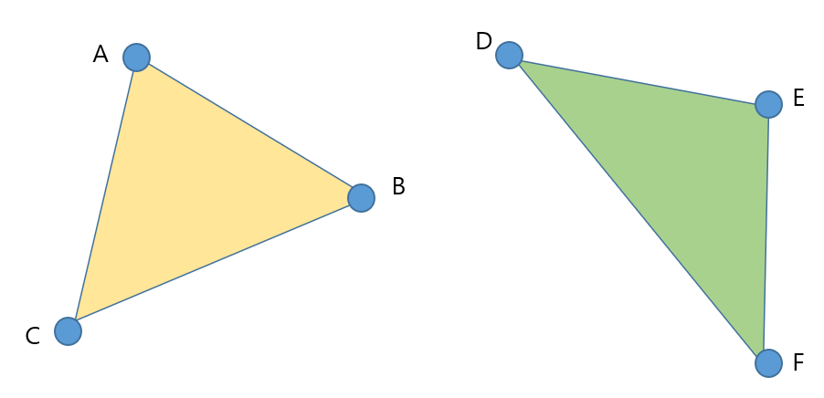
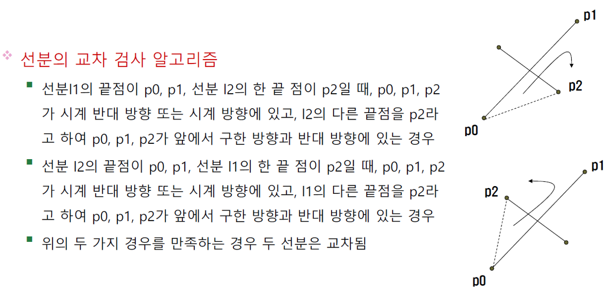
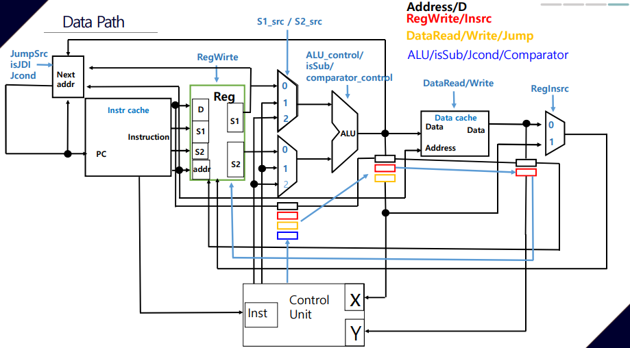
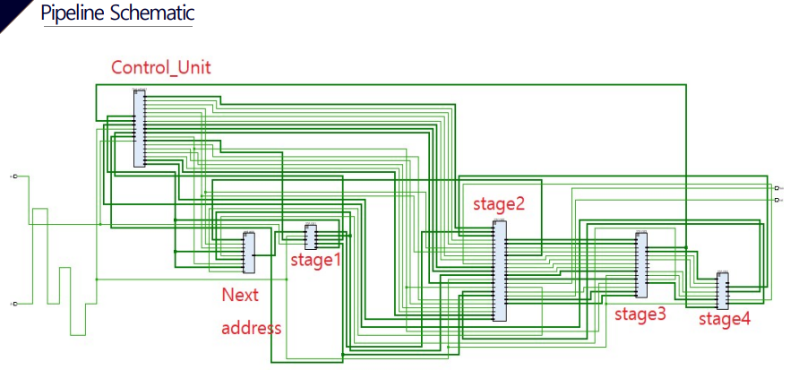
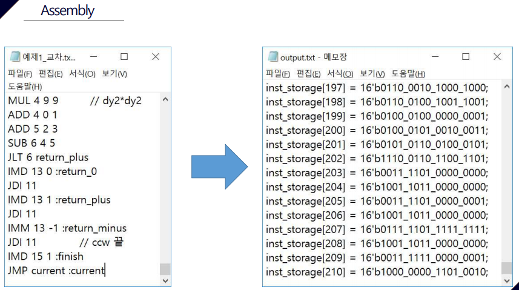
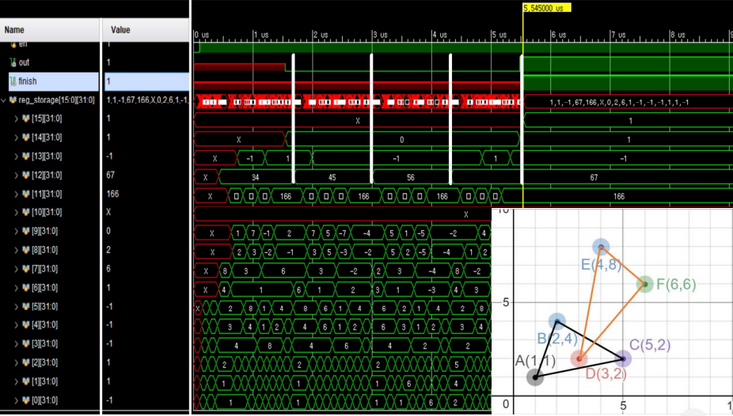
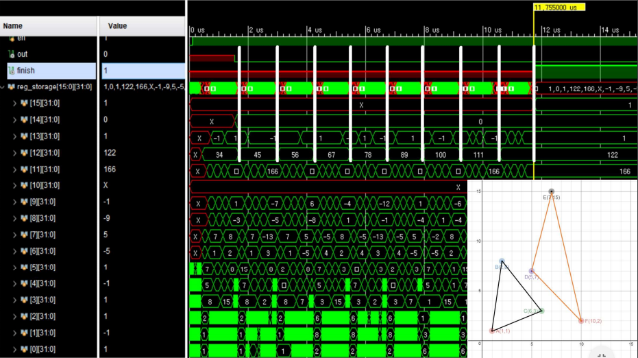

# ComputerArchitecture

Verilog를 이용한 두 삼각형의 충돌 여부 판단 CPU

Vivado 18.02

# Intro

두 삼각형, 즉 각각 3개의 x, y 좌표가 입력되면 두 삼각형의 충돌 여부를 알려준다.

# Algorithm

### 알고리즘 요약

선분의 교차 알고리즘을 사용한다.

각각 3개의 선분이 있으므로 총 3 X 3 = 9번 진행한다.

### CCW 알고리즘

선분 교차 알고리즘은 CCW 알고리즘을 사용한다.

CCW 알고리즘은 3점이 주어지면 시계 반대 방향으로 위치하는지 검사한다.

### Intersect 알고리즘

선분 교차 알고리즘은 두 선분, 즉 각각 2개의 x, y 좌표가 주어진다.

각각 4가지의 경우에서 CCW를 구하여 교차 여부를 알 수 있다.

# Data Format

### Data 자료형

2's complement를 사용하는 32 bit Integer

### 표현 가능 범위

-2^31 <= n < 2^31

# Data Path

4 cycle, PipeLine 

# Schemetic

# 설명

### Register (4 bit)

num | used
--- | ---
0	~ 10 | general register
11 | ccw return adress
12 | ccw return value
13 | intersect return address
14 | intersect return value
15 | function finish

### Data cache (16 bit)

num | 0 | 1 | 2 | 3 | 4 | 5 | 6 | 7 | 8 | 9 | 10 | 11 |
-- | -- | -- | -- | -- | -- | -- | -- | -- | -- | -- | -- |  -- |
used | A1 | A2 | B1 | B2 | C1 | C2 | D1 | D2 | E1 | E2 | F1 | F2 | 

num | 12 | 13 | 14 | 15 | 16 | 17 | 18 | 19 | 20 | 21 | 22 | 23 | 24 ~ 255 |
-- | -- | -- | -- | -- | -- | -- | -- | -- | -- | -- | -- | -- | -- |
used | a1 | a2 | b1 | b2 | c1 | c2 | d1 | d2 | ccw1 | ccw2 | ccw3 | ccw4 | non-used |

# 실행 방법

1. input.txt 에 명령을 입력한 후 Assembly.exe를 실행시키면 output.txt에 변환된 기계어 생성

2. 생성된 코드를 Data_Cache.v 파일 내에 붙여넣기

3. 시뮬레이션을 이용하여 결과 확인

# 실행 결과

#### 교차하는 경우

#### 교차하지 않는 경우

